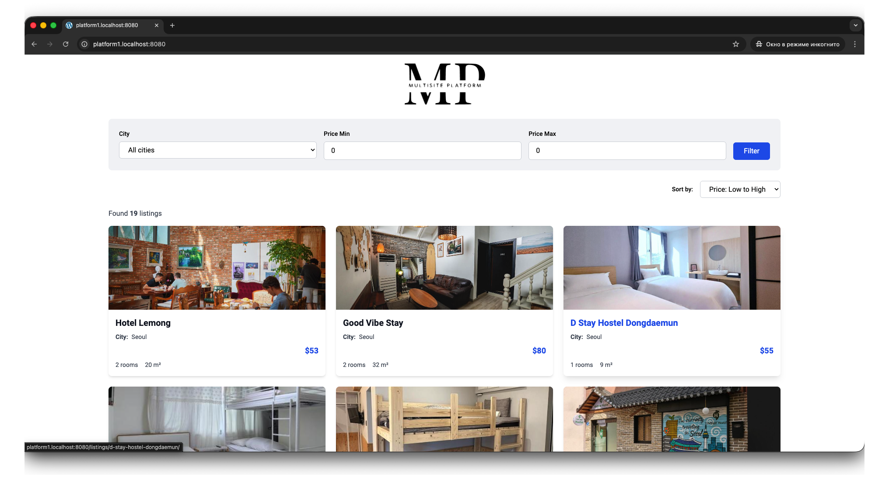
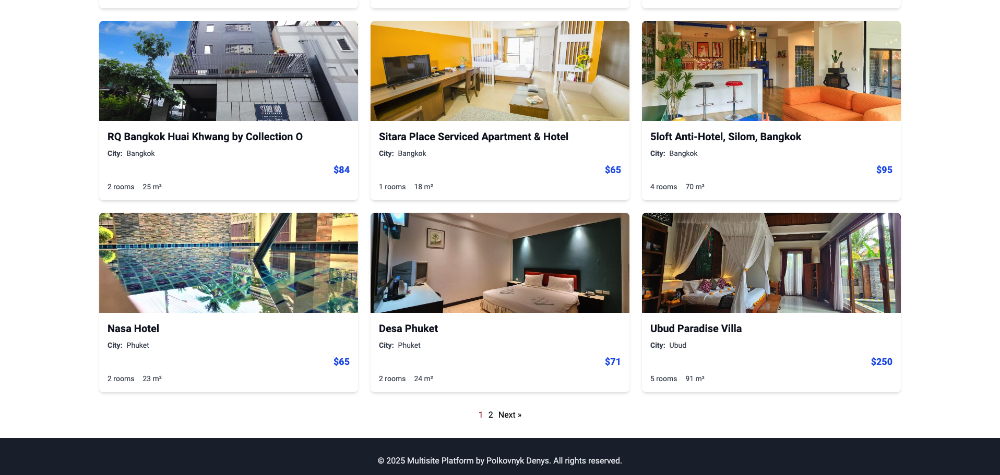
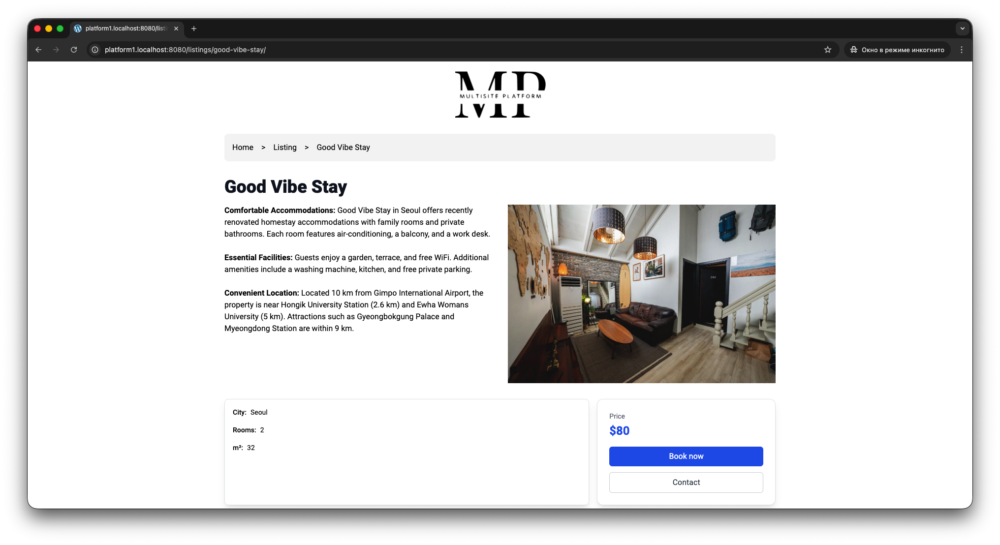
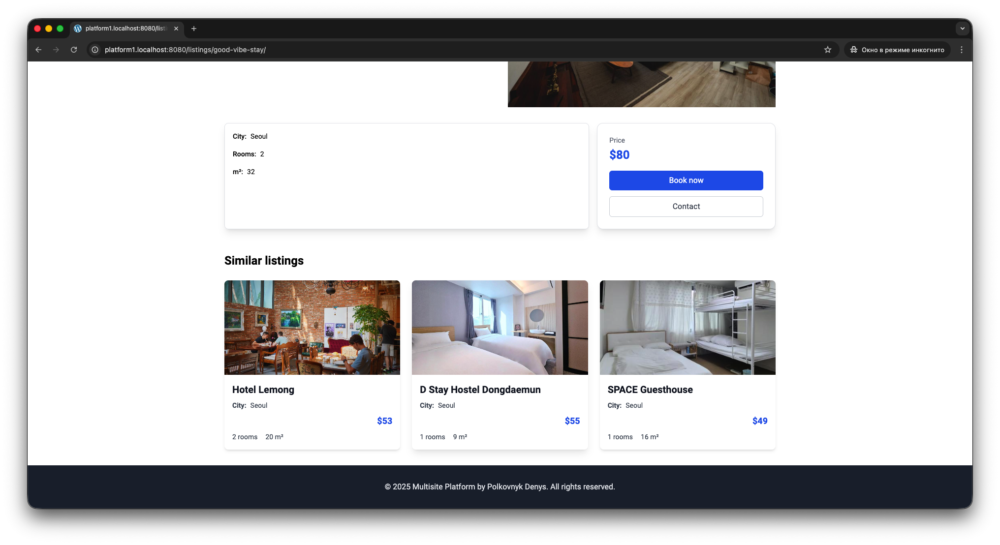
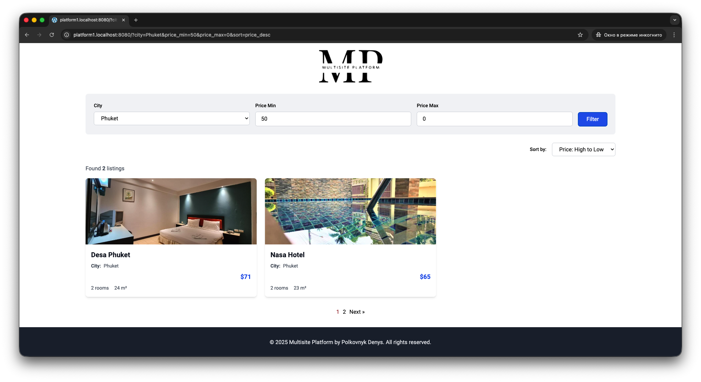
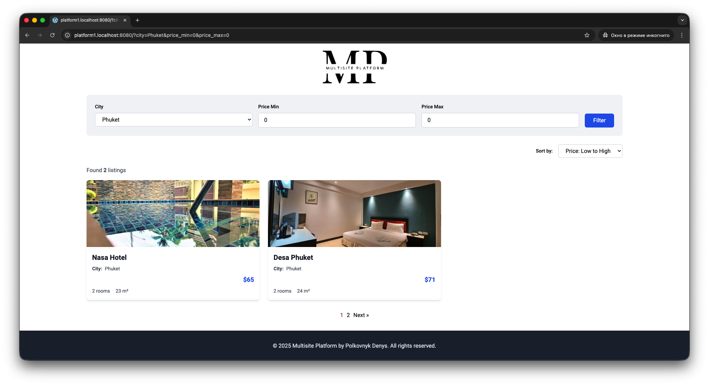
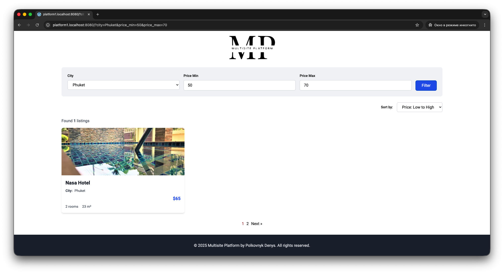
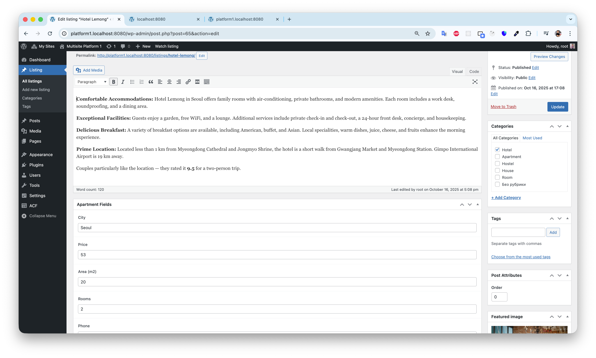
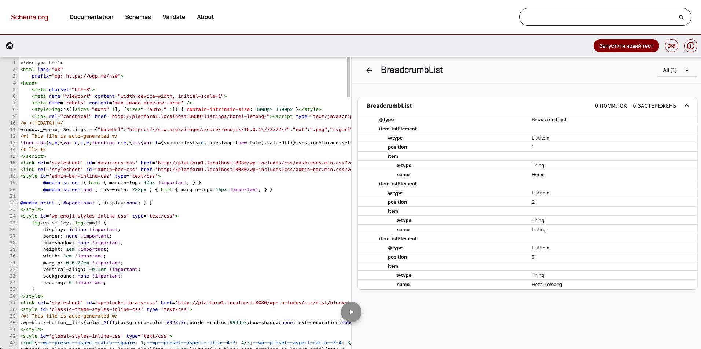
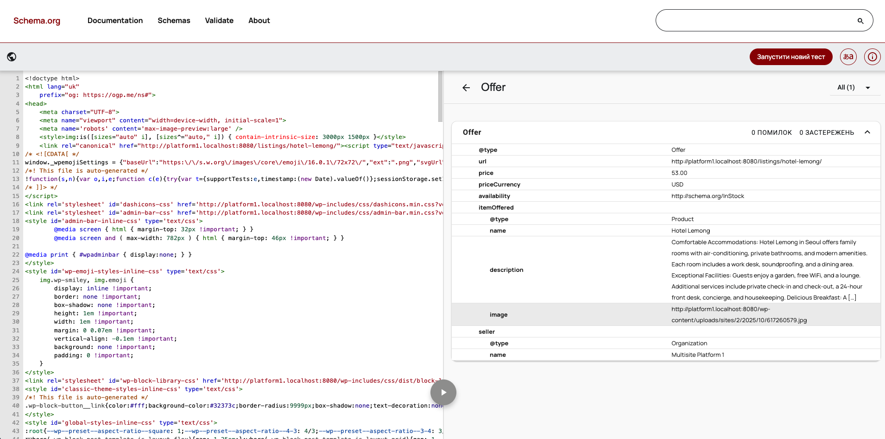

# Multisite Content Platform (WordPress)

Minimal multisite content platform with a “Listings” catalog: custom post type with ACF fields, filtering and sorting, basic SEO, AJAX, and security.

- WordPress Multisite (2+ subsites)
- Custom Post Type: `listings` (+ ACF fields)
- Catalog with GET-based filters and sorting
- Single page with Breadcrumbs + JSON‑LD `BreadcrumbList`
- Basic SEO per site: pretty permalinks, sitemap, robots, canonical
- Security: sanitization/escaping, nonces for AJAX

---

## Demo video

- Watch the 4‑min overview: [YouTube — Demo](https://youtu.be/Uh4G_ySNKgw)

<a href="https://youtu.be/Uh4G_ySNKgw">
  
</a>

## Screenshots

<div align="center">
  <!-- Пример: замени имена файлов на свои из папки screenshots -->
  <a href="screenshots/main_page_1.png">
    
  </a>
  <a href="screenshots/main_page_2.png">
    
  </a>
  <a href="screenshots/front_single_listings_page_1.png">
    
  </a>
  <a href="screenshots/front_single_listings_page_2.png">
    
  </a>
  <a href="screenshots/front_main_page_filter.png">
    
  </a>
  <a href="screenshots/front_main_page_filter_1.png">
    
  </a>
  
  <a href="screenshots/front_main_page_filter_2.png">
    
  </a>

   <a href="screenshots/admin_panel_create_new_listings.png">
    
  </a>

   <a href="screenshots/schema_breadrumbs_list.png">
    
  </a>

   <a href="screenshots/schema_offer.png">
    
  </a>
</div>

## 1) Environment

- OS: macOS (tested locally)
- Stack: WordPress 6.x, PHP 8.x, MySQL/MariaDB, Docker
- Build: Node + Webpack + Tailwind CSS
- Browser: Chrome latest

---

## 2) How to run (≤ 5 steps)

1. Enable Multisite in `wp-config.php`:
   - Add `define('WP_ALLOW_MULTISITE', true);` then Tools → Network Setup (subdomains recommended).
   - Create at least 2 subsites (e.g., `site1.local`, `site2.local`).
2. Activate the theme on each subsite: `Appearance → Themes → multisite_platform`.
3. ACF fields load automatically from `developer/wp-content/themes/multisite_platform/acf-json/`.
4. Fill 10–20 `listings` posts with different `city` and `price`.
5. Open the catalog:
   - Archive: `https://<subsite>/listings/`
   - Single: `https://<subsite>/listings/<post-slug>/`
   - Sitemap/robots per site: `/<subsite>/sitemap.xml`, `/<subsite>/robots.txt`

Build (if you change assets):

```bash
cd developer/wp-content/themes/multisite_platform
npm run prod
```

---

## 3) Where is the code

- CPT registration: `developer/wp-content/themes/multisite_platform/includes/theme-post-types.php`
- ACF JSON: `developer/wp-content/themes/multisite_platform/acf-json/`
- Catalog (filters/sorting/grid/pagination):
  - Section: `developer/wp-content/themes/multisite_platform/template-parts/sections/section-queries.php`
  - Filters UI: `developer/wp-content/themes/multisite_platform/template-parts/partials/filter-listings.php`
  - Sorting UI: `developer/wp-content/themes/multisite_platform/template-parts/partials/sort-listings.php`
  - Grid card: `developer/wp-content/themes/multisite_platform/template-parts/partials/card-listings.php`
  - Pagination: `developer/wp-content/themes/multisite_platform/template-parts/partials/paginate.php`
  - Query logic: `developer/wp-content/themes/multisite_platform/includes/theme-queries.php`, `developer/wp-content/themes/multisite_platform/includes/theme-helper-queries.php`
  - GET sanitization: `developer/wp-content/themes/multisite_platform/includes/template-part-helper.php` (`get_query_params()`)
- AJAX filtering:
  - PHP handler: `developer/wp-content/themes/multisite_platform/includes/theme-ajax.php`
  - JS: `developer/wp-content/themes/multisite_platform/src/js/partials/filters.js`
  - Script enqueue/localize: `developer/wp-content/themes/multisite_platform/dist/scripts.php`
- Single template:
  - Single: `developer/wp-content/themes/multisite_platform/single-listings.php`
  - Content: `developer/wp-content/themes/multisite_platform/template-parts/content/content-listings.php`
- Breadcrumbs + JSON‑LD:
  - BreadcrumbList schema: `developer/wp-content/themes/multisite_platform/template-parts/schema/breadcrumb-list.php`
  - Offer schema (bonus): `developer/wp-content/themes/multisite_platform/template-parts/schema/offer.php`
  - Hook to print schema/canonical: `developer/wp-content/themes/multisite_platform/includes/theme-hooks-add.php`
- Tailwind/Build:
  - Tailwind config: `developer/wp-content/themes/multisite_platform/tailwind.config.js`
  - CSS inline injection: `developer/wp-content/themes/multisite_platform/dist/scripts.php`

---

## 4) Features checklist

- Multisite (2+ subsites) — ready; per‑site sitemap (`/sitemap.xml`) and robots (`/robots.txt`) via WordPress core.
- CPT `listings` — supports `title`, `editor`, `thumbnail`, has archive.
- ACF fields — `city`, `price`, `area_m2`, `rooms`, `phone`. Displayed on single and used in filters.
- Catalog with filters (GET): `city`, `price_min`, `price_max`.
- Sorting: `sort = price_asc | price_desc | date_desc`.
- Security:
  - GET sanitization in `get_query_params()` (text sanitized, numbers via `absint`).
  - Escaping in templates: `esc_html`, `esc_attr`, `esc_url`.
  - AJAX: nonce via `wp_localize_script` + `wp_verify_nonce`.
- SEO:
  - Pretty permalinks (enable in WP).
  - Canonical `<link rel="canonical">` per page with pagination & whitelisted filters (see `theme-hooks-add.php`).
  - Breadcrumbs (UI optional) + JSON‑LD `BreadcrumbList`.
  - Offer JSON‑LD on single (bonus).

---

## 5) Filtering / Sorting (tech)

- GET form, no page builders.
- `WP_Query`:
  - `meta_query` for `price` boundary (min/max).
  - City filter via `meta_query` on `city`.
  - Sorting:
    - `price_asc/price_desc` — `orderby => meta_value_num, meta_key => price, meta_type => NUMERIC`
    - `date_desc` — `orderby => date, order => DESC`
- Pagination keeps GET args (see `paginate.php` with `add_args`).

---

## 6) AJAX

- Endpoint: `admin-ajax.php` with action `filter_listings`
- JS: submits GET params + `nonce`, updates results and URL (History API) without reload
- Nonce: localized in `ajaxData.nonce`, checked in `theme-ajax.php` (`wp_verify_nonce`)

---

## 7) SEO details

- Canonical builder strips noise (UTM, fbclid) and appends only whitelisted filters `city`, `price_min`, `price_max`, `sort`.
- JSON‑LD `BreadcrumbList`: `template-parts/schema/breadcrumb-list.php`
- JSON‑LD `Offer` (optional): `template-parts/schema/offer.php`
- Core `sitemap.xml` and `robots.txt` work per site in multisite.

---

## 8) Performance

- Tailwind CSS with production build (`npm run prod`)
- Minimal JS, vanilla fetch for AJAX
- Images use WP sizes; card/single templates avoid heavy components

---

## 9) Q&A (required short answers)

- Why GET for filters, not POST?

  - Shareable, crawlable URLs; browser navigation and canonical management; caching/CDN friendliness. Security is handled via sanitization and escaping.

- How do you guarantee numeric sorting by `price`?
  - `WP_Query` uses `orderby => meta_value_num`, `meta_key => price`, `meta_type => NUMERIC` to enforce numeric compare (not string lexicographic).

---

## 10) Screens / Video (placeholders)

- Video demo (2–5 min): [add link]
- Screenshots:
  - Multisite Sites list — [img]
  - Admin edit `listing` with ACF fields — [img]
  - Catalog with active filters/sorting — [img]
  - Single with breadcrumbs — [img]
  - HTML snippet with JSON‑LD BreadcrumbList — [img]

---

## 11) Plugins / Theme

- Theme: `multisite_platform` (no page builders)
- Plugins: Advanced Custom Fields (Free/Pro) for fields; no heavy page builders
- Purpose: ACF manages fields; everything else is custom code in the theme
